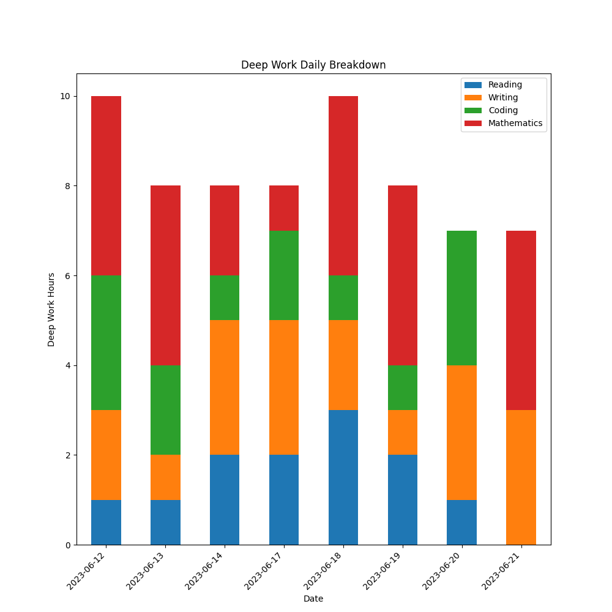

# Deep Work Log

Deep work is defined by Cal Newport as a state of peak concentration that lets one learn hard things and create quality work quickly. The goal of this repository is to allow one to log the accomplishments one has made by incorporating the deep work philosophy. To create charts, one need only update a CSV file and run a Python script.

## Dependencies

- pandas
- matplotlib

## Usage

1. Install the dependencies using pip:

```
pip install pandas matplotlib
```

2. Add rows to the `table.csv` file with the following format:

```
Date,Deep Work Hours,Reading,Writing,Coding
2023-06-12,8,3,2,3
2023-06-13,1,1,2,1
2023-06-14,8,2,3,3
2023-06-17,8,2,3,3
```

Note that the column names "Date" and "Deep Work Hours" should not be edited. The dates should be in the format the format `YYYY-MM-DD`.

3. Run the script:

```
python update_table.py
```

4. The following files will be generated:

- pie_chart.png
- stacked_bar_graph.png
- updated_totals.md

For this example, the pie chart will look like this:


And the stacked bar graph will look like this:



## Contributing

Pull requests are welcome. For major changes, please open an issue first to discuss what you would like to change.

Please make sure to update tests as appropriate.

## License

[MIT](https://choosealicense.com/licenses/mit/)

Let me know if you have any other questions!


