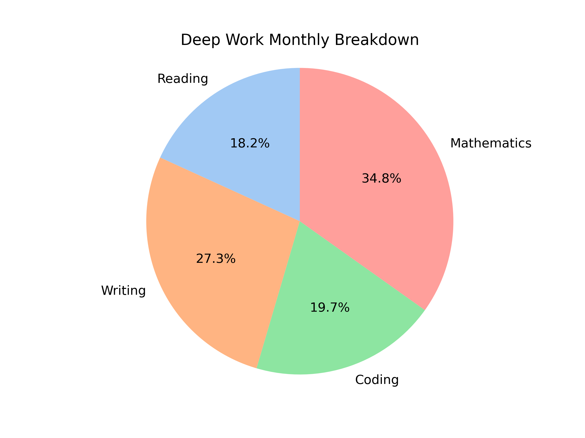
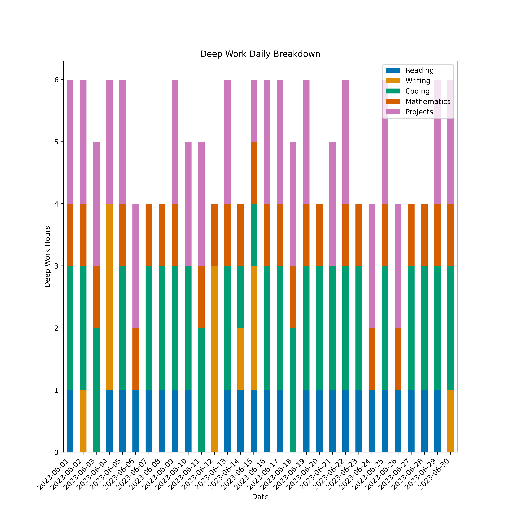
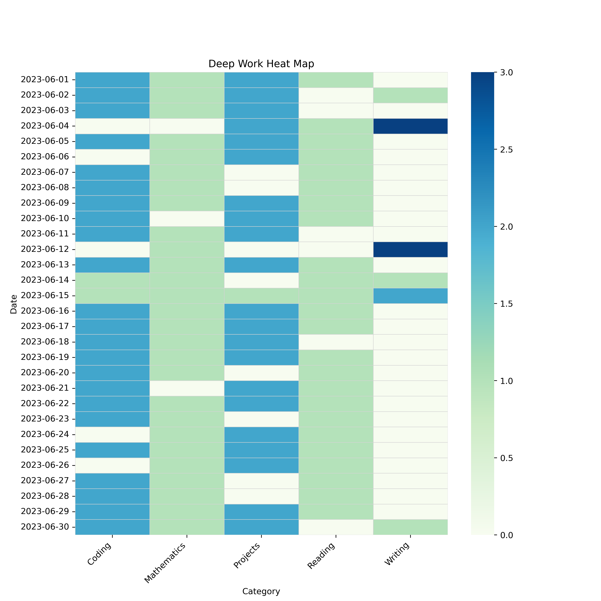

# Deep Work Tracker

Deep work is a state of peak concentration that lets one learn hard things and create quality work quickly. The goal of this repository is to allow you to track the accomplishments you've made by incorporating deep work into your workflow. To create a daily entry to a monthly log, you need only update a CSV file and run a Python script.

## Installation

You can install this project by cloning the repository, forking the repository, or downloading the zip files.

To **clone** the repository, open a terminal and run the following command:

```sh
git clone git@github.com:your-username/deep_work_tracker.git
```

Make sure to replace `your-username` with your GitHub username.

To **fork** the repository, click on the `Fork` button in the top-right corner of this page. This will create a copy of the repository in your GitHub account.

To **download** the zip files, click on the `Code` button in the top-right corner of this page and then click on `Download ZIP`. Extract the zip files to a directory of your choice

## Dependencies

- Pandas
- Matplotlib
- Seaborn 

## Usage

1. Install the dependencies using pip:

```
pip install pandas matplotlib seaborn
```

2. Add rows to the `table.csv` file located in the `MONTH_YEAR` directory in the following format:

```
Date,Deep Work Hours,Reading,Writing,Coding,Mathematics,Projects
2023-06-01,6,1,0,2,1,2
2023-06-02,6,0,1,2,1,2
2023-06-03,5,0,0,2,1,2
2023-06-04,6,1,3,0,0,2
2023-06-05,5,1,0,2,1,2
2023-06-06,4,1,0,0,1,2
...
```

For the `MONTH_YEAR` directory, make sure to replace `MONTH_YEAR` with the month and year for which you want to track your deep work hours. Add as many of these directories as you'd like. 

Notes about the `table.csv` file:
- Only the category columns (in this case, "Reading", "Writing", "Coding", "Mathematics", and "Projects") in this file should be replaced/deleted. 
- A date in the “Date” column should be in the format `YYYY-MM-DD`. 

3. Run the script:

```
python update_monthly_summary.py
```

4. The following files will be generated:

- `monthly_summary.md`
- `figures/pie_chart.png`
- `figures/stacked_bar_graph.png`
- `figures/heat_map.png`

For the `june_2023` example, `monthly_summary.md` will generate the following information:

```
Total Deep Work Hours: 66
Total Deep Work Hours (by Category):
  - Reading: 12
  - Writing: 18
  - Coding: 13
  - Mathematics: 23
```

Additionally, `monthly_summary.md` will contain `pie_chart.png`, which will look like this:



`stacked_bar_graph.png`, which will look like this:



And `heat_map.png`, which will look like this:



## Contributing

Pull requests are welcome. For major changes, please open an issue first to discuss what you'd like to change.

## License

[MIT](https://choosealicense.com/licenses/mit/)


